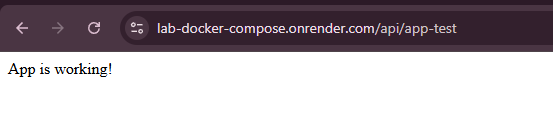
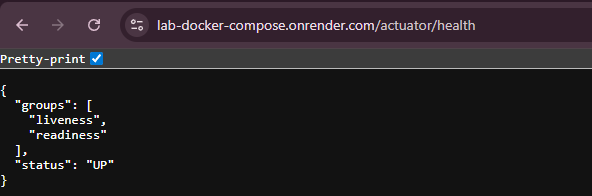
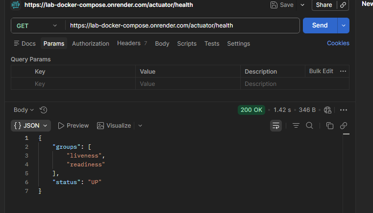
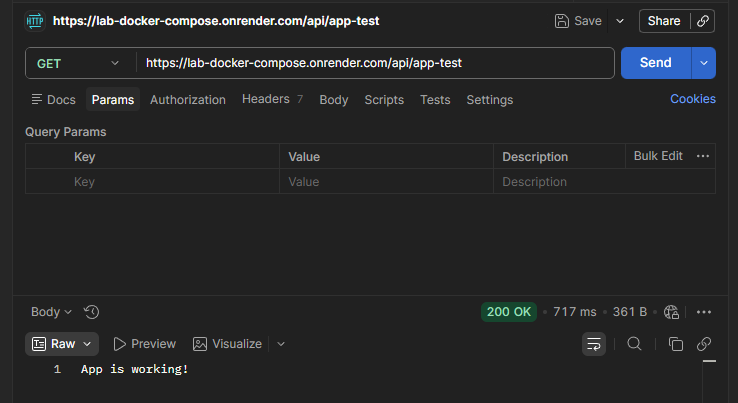
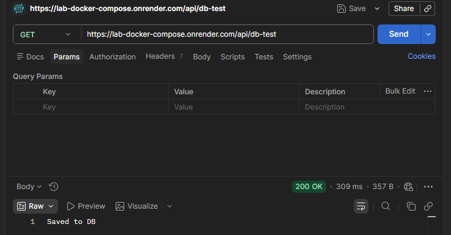
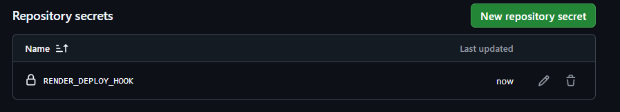

# Docker Compose & CI/CD Spring Boot Lab

A DevOps-focused Spring Boot project demonstrating how to run a backend application and database together using **Docker Compose**, automate build checks with **GitHub Actions**, and trigger deployment through a simple **CI/CD pipeline**.

The main goal of this repository is not complex business logic, but understanding how a backend application is containerized, connected to a database, tested in CI, and prepared for deployment.

---

## 🚀 Project Focus

This project focuses on:

- Running a Spring Boot application and MySQL database together with Docker Compose
- Connecting the application container to the database container
- Managing environment variables for containerized services
- Using Docker networks and volumes
- Adding database health checks before the application starts
- Building and verifying the project with GitHub Actions
- Triggering deployment through a CI/CD workflow
- Testing the deployed application with Postman and health endpoints

---

## 🛠️ Tech Stack

- Java 21
- Spring Boot
- Spring Data JPA
- MySQL
- Docker
- Docker Compose
- GitHub Actions
- Render
- Maven
- Spring Boot Actuator
- Postman

---

## 📦 Docker Compose Architecture

The project contains two main services:

| Service | Description |
|---|---|
| `db` | MySQL database container |
| `app` | Spring Boot application container |

The application and database run inside the same Docker Compose network.

The Spring Boot application connects to the database using the database service name instead of `localhost`.

Example:

```text
devops-db:3306
```

This is important because inside Docker, each container has its own isolated environment.

The Spring Boot app container cannot access the MySQL container through `localhost`; it must use the database container name or service name.

---

## 🐳 Running Locally with Docker Compose

Clone the repository:

```bash
git clone https://github.com/shaig-mahmudov/lab-docker-compose.git
cd lab-docker-compose
```

Start the application and database:

```bash
docker compose up --build
```

Check running containers:

```bash
docker compose ps
```

Stop the containers:

```bash
docker compose down
```

Stop containers and remove volumes:

```bash
docker compose down -v
```

---

## 🌐 Local Application

After running Docker Compose, the application should be available at:

```text
http://localhost:8080
```

The MySQL database is exposed locally on:

```text
localhost:3307
```

Inside the Docker network, the Spring Boot application connects to MySQL through:

```text
devops-db:3306
```

---

## 🧪 Health Check

Spring Boot Actuator is used to verify that the application is running.

Health endpoint:

```text
GET /actuator/health
```

Expected response:

```json
{
  "status": "UP"
}
```

---

## ⚙️ CI Pipeline

This project includes a GitHub Actions CI workflow.

The CI pipeline runs on:

- Push to the `main` branch
- Pull requests to the `main` branch
- Manual workflow dispatch

The pipeline is responsible for:

1. Checking out the repository
2. Setting up Java 21
3. Caching Maven dependencies
4. Running Maven verification

Main CI command:

```bash
mvn clean verify
```

This ensures that the application can be built successfully before deployment.

---

## 🚀 Deployment Pipeline

The deployment workflow is configured to run after the CI workflow completes successfully.

Deployment is triggered using a Render deploy hook stored as a GitHub Actions secret.

Required secret:

| Secret Name | Description |
|---|---|
| `RENDER_DEPLOY_HOOK` | Render deploy hook URL used to trigger deployment |

When the CI workflow succeeds, GitHub Actions sends a request to the Render deploy hook, and Render starts the deployment process.

---

## 🔐 Environment & Secrets

The application uses environment variables for configuration.

Typical Docker Compose environment values include:

```env
SPRING_DATASOURCE_URL=jdbc:mysql://devops-db:3306/devops_db
SPRING_DATASOURCE_USERNAME=root
SPRING_DATASOURCE_PASSWORD=password
```

For deployment, sensitive values should not be hardcoded.

They should be stored in the deployment platform or GitHub Secrets.

---

## ✅ What This Project Demonstrates

This repository demonstrates practical backend DevOps fundamentals:

- Containerizing a Spring Boot backend application
- Running an app and database together with Docker Compose
- Understanding container networking
- Using persistent database volumes
- Waiting for the database container to become healthy
- Running automated CI checks with GitHub Actions
- Triggering deployment through a CI/CD pipeline
- Testing the application with Postman
- Verifying the application with Actuator health checks

---

## 📸 Screenshots

This section contains screenshots from local Docker Compose testing, Postman API tests, Docker logs, CI/CD workflow, and deployment.

---

**Docker Running**


**App Test**


**DB Test**


**Containers Running**


**Docker Compose PS command result**


**Render**




**Acutator Health Tests**







**Postman Test**






**Deploy Hook Secret Added**



---

## 📌 Note

This is a learning-focused DevOps lab.

The purpose of this project is to understand the full flow of a backend application:

```text
Spring Boot App
      ↓
Dockerfile
      ↓
Docker Compose
      ↓
MySQL Database
      ↓
GitHub Actions CI
      ↓
Deployment Trigger
      ↓
Render Deployment
```

The main focus is **Docker Compose, CI/CD, and deployment**, not advanced business logic.


